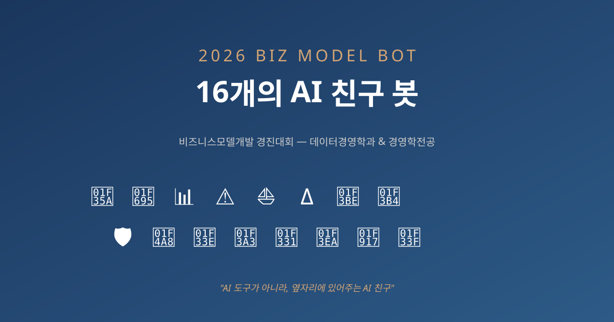

# 🤖 2026 비즈니스모델개발 경진대회 — 16개 AI 봇

**데이터경영학과 & 경영학전공** | 16팀이 만든 AI 친구 봇 모음

> *"AI 도구가 아니라, 옆자리에 있어주는 AI 친구"*

🔗 **[웹사이트 보기](https://sdkparkforbi.github.io/bizmodel-bots-2026/)** · 📜 **[학생 제안서 요약](https://sdkparkforbi.github.io/bizmodel-bots-2026/proposals.html)**

---

## 📋 16팀 한눈에 보기

| # | 팀명 | 학생 | 봇 이름 | MVP |
|---|---|---|---|---|
| 01 | (개인) | 김수연 | 🍚 **식구** | 음식 사진 → 영양 분석 + 식사 동반 대화 |
| 02 | (개인) | 최문혁 | 🚕 **택씨** | 카드내역 → 경비 자동 분류 + 환급액 |
| 03 | 21학번 F5 | 신세용·길민제·김지한·임현우·허교정 | 📊 **분개해** | 회계 문제 → 분개 풀이 + 단계 설명 |
| 04 | (개인) | 김리원 | ⚠️ **잠깐만** | 의심 문자/통화 판별 + 가족 알림 |
| 05 | (개인) | 김영연 | ⛵ **장보고** | 매일 아침 종목 3줄 뉴스 요약 푸시 |
| 06 | 에브리옵션 | 김영민·김윤호·이서희·홍성혁 | Δ **그릭** | 옵션 그리스 문자 Q&A + 의무교육 풀이 |
| 07 | 나혼자 달린다 | 박시영 | 🎾 **나달** | 자취 필수템 + 구독 정리 + 자취 꿀팁 |
| 08 | 핀포커스 | 송승원·최진규 | 🎴 **핀포커 (포커)** | 종목 호재/악재 즉시 잠금화면 푸시 |
| 09 | 첫 단추 | 강유위·장서현·백두산·신우용 | 🛡️ **지키미** | 청년 대출 RAG + 신용 코칭 (통계 기반) |
| 10 | 싹쓰리 | 유혜린·황규민·김정민 | 💨 **숨돌이** | 매매 직전 호출 → 24시간 챌린지 |
| 11 | 섭섭헌 진우 | 임대섭·백진우·윤상헌·천우솔·김희서 | 🌾 **곳간이** | 현금 흐름 예측 + 환불 자동 진단 |
| 12 | (개인) | 이성채 | 🎣 **출조각** | 위치+어종 → AI 출조 확률 % 예측 |
| 13 | 알고리즘 탈출 연구소 | 임예영 | 🌱 **새로미** | 최근 본 콘텐츠 → 의외의 새 취미 추천 |
| 14 | 세일즈더베럴 | 지소윤 | 🏪 **상도** | 영업 회사 자동 리서치 + 콜드콜 스크립트 |
| 15 | (개인) | 권서영 | 🤗 **토닥이** | 매일 일기 → 공감 + 응원 + 작은 미션 |
| 16 | (개인) | 김하은 | 🌿 **하루** | 주 1회 균형 체크인 + 작은 실천 1개 |

---

## 🎯 16팀 공통 본질

> **"AI가 친구처럼 옆자리에 있어주는 봇"**

- 각자 다른 영역(식사/세무/투자/심리 등)에서
- 친구 호출 가능한 이름 (식구야, 택씨야, 장보고야...)
- 사용자의 일상에 자연스럽게 통합되는 카카오톡 봇

---

## 💡 공통 기술 스택 (LiveAvatar 기반)

모든 봇이 동일한 인프라 — **3D 아바타 + 음성 대화 웹 앱**:

| 영역 | 기술 |
|---|---|
| **프론트엔드** | React 19 + Vite 8 |
| **3D 아바타** | Three.js + @pixiv/three-vrm (VRM 캐릭터) |
| **실시간 음성/비디오** | LiveAvatar (LiveKit 기반) |
| **LLM** | OpenAI API |
| **RAG** | 벡터 DB (도메인별 지식) |
| **호스팅** | Vercel |
| **공유** | Kakao Developer SDK (링크/공유용) |

→ **봇별 차이 = ① RAG 데이터 ② VRM 아바타 캐릭터 ③ 시스템 프롬프트 (3가지만)**

운영비: 봇당 월 5~10만원 (OpenAI + LiveKit 사용량)

> 📌 참고 레포: [cha-interview-bot-liveavatar-my](https://github.com/sdkparkforbi/cha-interview-bot-liveavatar-my)
> (차의과학대 신입생 전공 상담 챗봇 — LiveAvatar 마이그레이션 버전)

---

## 🏛️ 한국 역사 인물 봇 패밀리

- 🌊 **장보고** (신라 해상왕) — 투자/시장
- 🏪 **상도** (조선 거상 임상옥) — B2B 영업

→ K-비즈니스 AI 브랜드 가능성

---

## 📜 라이선스

각 봇의 컨셉은 해당 학생/팀의 지적 자산입니다.
이 문서는 2026-1 비즈니스모델개발 경진대회 정리 자료입니다.
